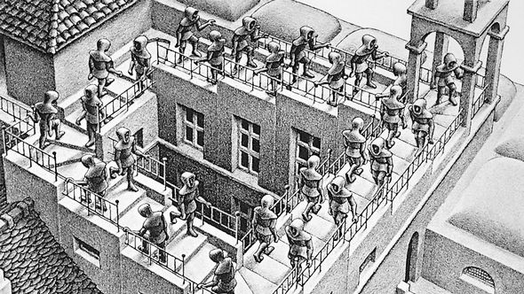
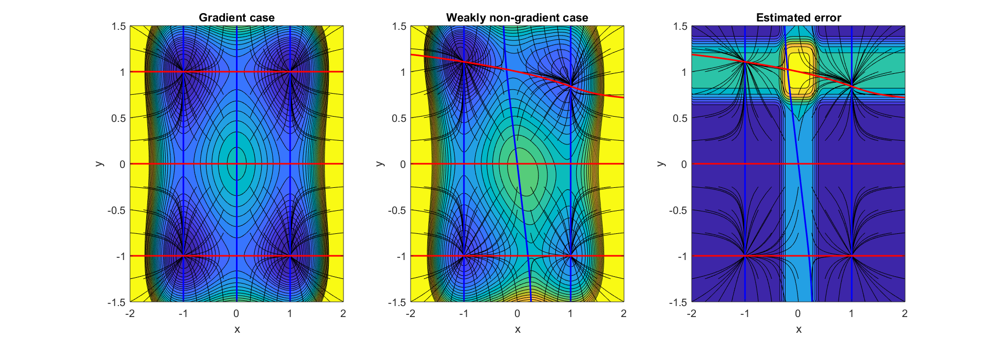
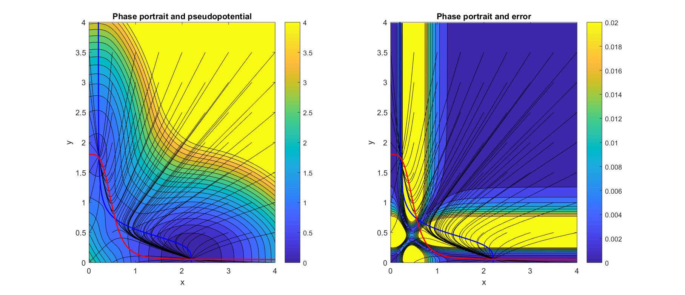

```{r setup, include = FALSE}
knitr::opts_chunk$set(
  collapse = TRUE,
  echo = FALSE,
  warning = FALSE,
  message = FALSE,
  comment = "#>"
)
```

# Introduction
With knowledge becoming progressively more interdisciplinary, the relevance of science communication is increasing fast. Mathematical concepts are among the hardest topics to communicate to non-expert audiences, policy makers, and also to scientists with little mathematical background. Visual methods are known to be successful ways of explaining mathematical concepts and results to non-specialists.

One particularly successful visualization method is that of the stability landscape, also known as the rolling marble or ball-in-a-cup diagram (@Beisner2003). In stability landscapes (e.g.: figure $\ref{fig:aew}$) the horizontal position of the marble represents the state of the system at a given time. With this picture in mind, the shape of the surface represents the underlying dynamical equations, where the slope is the driver of the movement. The peaks on the undulated surface represent unstable equilibrium states and the wells represent stable equilibria. Different basins of attraction are separated by _mountain ridges_ in the surface. Summarizing: the marble naturally rolls downhill to the lowest point of its basin of attraction. 

Stability landscapes have proven to be a successful tool to explain aspects about stability of dynamical systems in an intuitive way. Stability landscapes have been used to explain concepts as multistability, basin of attraction and even bifurcation points and hystheresis (see @Beisner2003, @Scheffer2001).

The main reason for the success of this picture arises from the fact that stability landscapes are built as an analogy with our most familiar dynamical system: movement. Particularly, the movement of a marble along a curved surface under the influence of its own weight and a strong frictional force. The stability landscape corresponds then with the physical concept of potential energy (@Strogatz1994). This explains why our intuition, based in what we know about movement in our everyday life, works so well reading this diagrams. It is important to stress the fact that under this picture there's not such a thing as inertia (@Beisner2003). The accurate analogy is that of a marble rolling in a surface while submerged inside a very viscous fluid (@Strogatz1994).

```{r aew, fig.cap = '(ref:wur)', fig.align = 'center'}
knitr::include_graphics('img/sl.jpg')
```

(ref:wur) Example of a set of 4 stability landscapes from @Scheffer2001. The upper side of the figure shows the stability landscape of a one-dimensional system for 4 different values of a control parameter. The lower side shows the bifurcation diagram. This diagram proved to be a succesful tool for explaining advanced concepts in bifurcation theory such as bistability and fold bifurcations.

Like with any other analogy, it is important to be aware of its limitations. The most important one is the fact that, for models with more than one state variable, such a potential doesn't exist in general. To get an intutive feeling of why this is true, picture a model with a stable cyclic attractor. As the slope of the potential should reflect the speed of change, we would need a potential landscape where our marble can roll in a closed loop while always going downhill. The kind of surface that only exists in M.C. Escher's famous work (see figure \@ref(fig:escher)).

```{r escher, fig.cap = '(ref:escher)', out.width = "250px", fig.align = 'center'}

```

(ref:escher) Detail of M.C. Escher's _Klimmen en dalen_. Lithography, 1960. In this surface, the walkers can walk in a closed loop that permanently goes downhill. Unfortunately, such a surface only exists in the imagination of surrealist artists

In this work we present a detailed overview of the conditions that a model has to fulfill to be associated with a potential. Next, we center our attention in systems that fail to fulfill those conditions, and we introduce an algorithm to decompose those systems as the sum of a gradient and a curl part. Each part can be used, respectivelly, to compute an associated potential and to measure the local error introduced by our picture.

Additionally, we provide a ready to use _R_ package that implements the algorithm described in the present paper.

## Mathematical background

Consider a coupled differential equation with two state variables $x$ and $y$. The dynamics of such system can be described by a two-dimensional stability landscape if a potential function $V(x,y)$ exists whose slope is proportional to the change in time of both states (equation \@ref(eq:2D)).
\begin{equation}
  \begin{cases}
    \frac{dx}{dt} = f(x,y) = - \frac{\partial V}{\partial x} \\
    \frac{dy}{dt} = g(x,y) = - \frac{\partial V}{\partial y}
  \end{cases}
  (\#eq:2D)
\end{equation}

Such a potential $V(x,y)$ exists if and only if the crossed derivatives of functions $f(x,y)$ and $g(x,y)$ are equal for all $x$ and $y$ (equation \@ref(eq:2Dcond)). Vector fields satisfying equation \@ref(eq:2Dcond) are known as conservative, irrotational or gradient fields (cf. section 8.3 of @Marsden2003).

\begin{equation}
\frac{\partial f}{\partial y} = \frac{\partial g}{\partial x}
(\#eq:2Dcond)
\end{equation}

If an only if condition \@ref(eq:2Dcond) holds, we can use a line integral (@Marsden2003, section 7.2) to invert \@ref(eq:2D) and calculate $V(x,y)$ using the equations $f(x,y)$ and $g(x,y)$ as an input. An example of this inversion is equation \@ref(eq:2Dint), where we have chosen an integration path composed of a horizontal and a vertical line. The attentive reader may have raised her or his eyebrow after reading the word _chosen_ applied to an integration path. In fact, we can introduce this arbitrary choice without affecting the final result. The condition for potentials to exist (equation \@ref(eq:2Dcond)) is entirelly equivalent (cf. section 7.2 of @Marsden2003) to the path independence of any line integral between two points inside this vector field. If the condition was not fulfilled, the calculated potential will have depended crucially on the chosen integration path. Being an arbitrary choice, the computed potential will have been an artifact with no natural meaning.

\begin{equation}
V(x,y) = V(x_0, y_0) - \int^{x}_{x_0} f(\xi, y_0) d\xi - \int^{y}_{y_0} g(x, \eta) d\eta
(\#eq:2Dint)
\end{equation}

## Generalization

Dynamics in equation \@ref(eq:2D) and the condition for the crossed derivatives \@ref(eq:2Dcond) can be straightforwardly generalized (see equations \@ref(eq:anyD) and \@ref(eq:anyDcond) to systems with an arbitrary number of state variables $\vec x = (x_1, ..., x_n)$. Particularly, if and only if our system of equations $\frac{dx_i}{dt} = f_i(\vec x)$ satisfies the condition:

\begin{equation}
  \frac{\partial f_i}{\partial x_j} = \frac{\partial f_j}{\partial x_i} : i \neq j
(\#eq:anyDcond)
\end{equation}

then exists a potential $V(\vec x)$, related to the original vector field by:

\begin{equation}
  f_i(\vec x) = -\frac{\partial V}{\partial x_i} : i = 1..n
(\#eq:anyD)
\end{equation}

and such a potential can be computed using:

\begin{equation}
V(\vec x) = V(\vec x_0) - \int_\Gamma \sum_{i=1}^n f_i(\vec x) dx_i
(\#eq:anyDint)
\end{equation}

where the line integral in \@ref(eq:anyDint) is computed along any curve $\Gamma$ joining the points $\vec x_0$ and $\vec x$.

The method we'll present in the next section lies in the fact that the conditions \@ref(eq:anyDcond) are equalities between functions, that is, both cross derivatives have to be equal at each point $\vec x$. Their difference, thus, will not remain constant in the whole phase space. In general, there will be regions where the conditions \@ref(eq:anyDcond) are, at least, approximately fulfilled. Those regions will admit an approximate potential.

It is important to note that the number of equations ($N$) contained in condition \@ref(eq:anyDcond) grows with the dimensionality of the system ($D$), particularly following the series of triangular numbers $N = \frac{1}{2}(D-1)D$. Thus, the higher the dimensionality, the harder it gets to fulfill condition \@ref(eq:anyDcond). As a side effect, we see that in one-dimensional systems the condition contains $0$ equations and is thus automatically fulfilled, meaning that one-dimensional systems always have a well defined stability landscape.

# Methods
The method for deriving a potential we propose is based on the decomposition of a vector field in a conservative or gradient part and a non-conservative or curl part (see equation \@ref(eq:FieldDecomposition)).

\begin{equation}
\vec f (\vec x) = \vec f_{grad} (\vec x) + \vec f_{curl} (\vec x)
(\#eq:FieldDecomposition)
\end{equation}

$\vec f_{grad} (\vec x)$ captures the part of the system that can be associated to a potential function, while $\vec f_{curl} (\vec x)$ represents the deviation from this ideal case. We'll use $\vec f_{gradient} (\vec x)$ to compute an approximate potential. The absolute error of this approach will be given by $\parallel \vec f_{curl} (\vec x) \parallel$. In those regions where the gradient term is stronger than the curl term, the previously calculated potential will represent an acceptable approximation of the underlying dynamics. The next steps show an easy way of achieving such a decomposition.

The reader is probably familiar with the concept of linearization, also known as Taylor expansion. Any sufficiently smooth and continuous vector field $\vec f(\vec x)$ can be approximated around a point $\vec{x_0}$ using equation \@ref(eq:TaylorExp), where $J(\vec{x_0})$ is the jacobian matrix evaluated at the point $\vec{x_0}$ and $\Delta \vec x$ is defined as the distance to this point, that is, $\Delta \vec x = \vec x - \vec{x_0}$, written as a column vector.

\begin{equation}
\vec f(\vec x) \approx \vec f(\vec{x_0}) + J(\vec{x_0}) \cdot \Delta \vec x
(\#eq:TaylorExp)
\end{equation}

As usual in linearization, we have neglected the terms of order $2$ and higher in equation \@ref(eq:TaylorExp). This approximation is valid for $\vec{x}$ close to $\vec{x_0}$. For an equation like \@ref(eq:TaylorExp), the condition \@ref(eq:anyDcond) becomes a very simple restriction on the jacobian matrix: for the system to be gradient, its jacobian has to be symmetric (see equation \@ref(eq:jaccond), where $t$ represents transposition).

\begin{equation}
J = J^T
(\#eq:jaccond)
\end{equation}

We know from basic linear algebra that any square matrix $M$ can be uniquely decomposed as the sum of a skew and a symmetric matrix (see equation \@ref(eq:SkewSymDec)).

\begin{equation}
  \begin{cases}
    M_{Symm} = \frac{1}{2} \left( M + M^T \right) \\
    M_{Skew} = \frac{1}{2} \left( M - M^T \right)
  \end{cases}
(\#eq:SkewSymDec)
\end{equation}

Using the skew symmetric decomposition described in equation \@ref(eq:SkewSymDec), we can rewrite \@ref(eq:TaylorExp) as:

\begin{equation}
\vec f(\vec x) \approx \vec f(\vec{x_0}) + J_{Symm}(\vec{x_0}) \cdot \Delta \vec x + J_{Skew}(\vec{x_0}) \cdot \Delta \vec x
(\#eq:TaylorExpDecomposed)
\end{equation}

Equation \@ref(eq:TaylorExpDecomposed) represents a natural, well-defined and operational way of writing our vector field $\vec f(\vec x)$ decomposed as in equation \@ref(eq:FieldDecomposition), that is, as the sum of a gradient and a non-gradient term[^3] (see \@ref(eq:decomposition)).

[^3]: This decomposition is related with the Helmholtz decomposition: it is proven that, for a huge range of easy to fulfil conditions, any vector field can be decomposed as $\vec f (\vec x) = - \vec \nabla V (\vec x) + \vec \nabla \times \vec A (\vec x )$, where $V$ and $\vec A$ are known as scalar and vector potentials. Both of them have a straightforward natural interpretation, and are widely used, for instance, in electromagnetism and fluid dynamics.

\begin{equation}
  \begin{cases}
    \vec f_{grad} (\vec x) \approx \vec f(\vec{x_0}) + J_{Symm}(\vec{x_0}) \cdot \Delta \vec x \\
    \vec f_{curl} (\vec x) \approx J_{Skew}(\vec{x_0}) \cdot \Delta \vec x
  \end{cases}
(\#eq:decomposition)
\end{equation}

The gradient term can thus be associated to a potential $V(\vec x)$, whose shape can be computed analytically using a line integral (see equation \@ref(eq:anyDint)). The result of this integration yields a relationship between the value of the potential at two points \@ref(eq:Potential).

\begin{equation}
\boxed{ 
  V(\vec{x_0} + \Delta \vec x) \approx  V(\vec{x_0}) - \vec f(\vec x_0) \cdot \Delta \vec x - \frac{1}{2} \Delta \vec x^T \cdot J_{Symm} (\vec{x_0}) \cdot \Delta \vec x
}
(\#eq:Potential)
\end{equation}

Using this potential $V(\vec x)$, we can rewrite our dynamical system as in equation \@ref(eq:MainResult). Due to the approximations used, this result will only be true on the vicinity of $\vec{x_0}$.

\begin{equation}
\vec f(\vec x) \approx -\vec \nabla V + \vec f_{curl}(\vec x)
(\#eq:MainResult)
\end{equation}

The stability landscape described in \@ref(eq:Potential) not only has been derived from a linearized system, but also completely neglects the effects of the curl part of the system As with any other approximation we need a way to estimate its error. From equation \@ref(eq:MainResult) it is apparent that we can use $\vec f_{curl} (\vec x)$ as an approximation of the local error introduced by our algorithm (see equation \@ref(eq:error)).

\begin{equation}
\boxed{
  err^2(\vec x) \approx \| \vec f_{curl}(\vec x) \|^2 \sim \| J_{Skew}(\vec{x}) \|^2
}
(\#eq:error)
\end{equation}

## Numerical algorithm
Equation \@ref(eq:Potential) can be rewritten as \@ref(eq:PotentialNum), where $\vec{x_0}$ represents the approximation point, $\vec{x_1}$ represents a neighbouring point and the potential difference between both points is given by $\Delta V(\vec{x_1}, \vec{x_0}) \equiv V(\vec{x_1}) - V(\vec{x_0})$.

\begin{equation}
\Delta V(\vec{x_1}, \vec{x_0}) \approx - \vec f(\vec x_0) \cdot (\vec{x_1} - \vec{x_0}) - \frac{1}{2} (\vec{x_1} - \vec{x_0})^T \cdot J_{Symm} (\vec{x_0}) \cdot (\vec{x_1} - \vec{x_0})
(\#eq:PotentialNum)
\end{equation}

Provided we know the value of the potential at one point $\vec x_{previous}$, equation \@ref(eq:PotentialNum) allows us to estimate the potential at a different point $\vec x_{next}$ (cf.: equation \@ref(eq:Iterator)).

\begin{equation}
V(\vec x_{next}) \approx V(\vec x_{previous}) + \Delta V(\vec x_{next}, \vec x_{previous})
(\#eq:Iterator)
\end{equation}

The abovementioned ideas can be applied to the numerical computation of the approximate potential over a grid of points by following this list of steps:

\begin{enumerate}
  \item Create a grid in the phase plane $\left\lbrace \vec x_i \right\rbrace$
  \item Calculate the jacobian $J(\vec{x_i})$ in each grid point
  \item Decompose each jacobian in its skew $J_{Skew}(\vec{x_i})$ and symmetric $J_{Symm}(\vec{x_i})$ components
  \item Assign potential 0 to the first point in the grid
  \item Use equation \@ref(eq:Iterator) to iterativelly calculate the values of the potential at each point of the grid
  \item Use the values of $J_{Skew}(\vec{x_i})$ as a measure of the quality of the approximation point by point.
\end{enumerate}

By introducing a grid, we expect the linearization error to decrease with the square of the grid's step size. The more fundamental error due to ignoring the curl component of our system cannot be affected by the grid's step choice, but the algorithm provides us with a measure of its magnitude point-by-point.

## Two-dimensional example

For instance, to calculate the value of $V$ at the point $(x_3, y_2)$ of a grid, we should begin by assigning $0$ to the potential at our arbitrary starting point (i.e.: $V(x_0, y_0) = 0$ by definition). Then, we need a trajectory that goes from $(x_0,y_0)$ to $(x_3, y_2)$, iterating over the intermediate grid points (see figure \@ref(fig:steps)).


```{r steps, fig.width = 4, fig.height = 3, fig.align = 'center', fig.cap = '(ref:steps)'}
library(ggplot2)
d=data.frame(x=c(0,1,2,3,3), y=c(0,0,0,0,1), vx=c(1,2,3,3,3), vy=c(0, 0, 0, 1, 2))

ggplot() +
geom_segment(data=d, mapping=aes(x=x, y=y, xend=vx, yend=vy), arrow=arrow(), size=2, color="black") +
geom_point(data=d, mapping=aes(x=x, y=y), size=4, shape=21, fill="white") +
geom_point(data=d, mapping=aes(x=vx, y=vy), size=4, shape=21, fill="white") +
scale_x_continuous(breaks=c(0, 1, 2, 3), labels=c("x_0", "x_1", "x_2", "x_3")) +
scale_y_continuous(breaks=c(0, 1, 2, 3), labels=c("y_0", "y_1", "y_2", "y_3")) +
theme(panel.grid.minor.x = element_blank()) +
theme(panel.grid.minor.y = element_blank())
```

(ref:steps) Path used to go from point $(x_0,y_0)$ to $(x_3, y_2)$. Note that this is not the only possible path. Our algorithm converges to the same potential regardless of the path chosen thanks to neglecting the skew part of the jacobian in our linearization process.

In the first step we go from $(x_0, y_0)$ to $(x_1, y_0)$. The new potential is thus (using \@ref(eq:Iterator)):

\begin{equation}
V(x_1, y_0) \approx V(x_0, y_0) + \Delta V(x_1, y_0; x_0, y_0)
(\#eq:IteratorEx1)
\end{equation}

The next two steps continue in the horizontal direction, all the way to $(x_3, y_0)$. The value of the potential there is:

\begin{equation}
V(x_3, y_0) \approx V(x_0, y_0) + \Delta V(x_1, y_0; x_0, y_0) + \Delta V(x_2, y_0; x_1, y_0) + \Delta V(x_3, y_0; x_2, y_0)
(\#eq:IteratorEx2)
\end{equation}

Now, to reach our destination $(x_3, y_2)$ we have to move in the vertical direction:

\begin{equation}
\begin{split}
V(x_3, y_2) \approx V(x_0, y_0) + \Delta V(x_1, y_0; x_0, y_0) + \Delta V(x_2, y_0; x_1, y_0) + \Delta V(x_3, y_0; x_2, y_0) + \\
+ \Delta V(x_3, y_1; x_3, y_0) + \Delta V(x_3, y_2; x_3, y_1)
\end{split}
(\#eq:IteratorEx3)
\end{equation}

Generalizing the previous example we see that, for a generic point $(x_i, y_j)$, we can compute the approximate potential using the closed formula \@ref(eq:NumericalRecipe).

\begin{equation}
\boxed{
V(x_i, y_j) = V(x_0, y_0) + \sum_{k = 1}^i \Delta V(x_k, y_0; x_{k-1}, y_0) + \sum_{l = 1}^j \Delta V(x_i, y_l; x_i, y_{l-1})
}
(\#eq:NumericalRecipe)
\end{equation}

Formula \@ref(eq:NumericalRecipe) has been derived sweeping first in the horizontal direction and next in the vertical one. Of course, we can choose different paths of summation. Because we are building our potential neglecting the curl part of our vector field, we know that our results will converge to the same solution regardless of the chosen path.

## Code package
In the spirit of reproducible research, we published an _R_ package that applies the abovementioned algorithm. It is freely available at: TBA.

# Results

## A synthetic example
We tested our algorithm with a synthetic model of two uncoupled state variables each with two attractors. As both states are uncoupled, this system is gradient and has a potential with four wells. We added interaction terms $p_x$ and $p_y$ to be able to make it gradually non-gradient (see equation \@ref(eq:TestField)). When we chose those perturbations to be zero, the system becomes gradient and corresponds with a four-well potential. Our algorithm rendered it succesfully (cf. figure $\ref{fig:synthetic}$, left panel).

\begin{equation}
  \begin{cases}
    \frac{dx}{dt} = f(x,y) = -x (x^2 - 1) + p_x(x,y)\\
    \frac{dy}{dt} = g(x,y) = -y (y^2 - 1) + p_y(x,y)
  \end{cases}
(\#eq:TestField)
\end{equation}

When non-zero perturbations are introduced a four-well potential is still recognizable (figure $\ref{fig:synthetic}$, central panel). The error obtained correlates with the two perpendicular stripes of the plane $(x,y)$ were we defined the perturbations to be maximum (figure \@ref(fig:synthetic), right panel).

```{r synthetic, fig.cap = '(ref:synthetic)', out.width = '450px', fig.align = 'center'}

```

(ref:synthetic) In all three figures the red and blue lines represent the nullclines of $x$ and $y$, respectivelly. Several trajectories are plotted in black. The contour plot in figure a) shows the potential calculated for the gradient case (i.e.: $p_x(x,y) = p_y(x,y) = 0$). As expected, the stable equilibria correspond to the wells. The contour plot in figure b) also shows the potential, but now a non gradient term has been introduced. It can be noticed that the shape of the potential has been distorted. Notice also that the two equilibria at the upper side of the plot fall slightly outside their closest well. The equilibria at the bottom, to the contrary, fit perfectly centered in their corresponding wells. Figure c) shows the estimated error of our computed potential. This figure warns us against trusting the potential we obtained in the upper and central region, and guarantees us that elsewhere it will work fine. Notice that the two upper equilibria lie in a region where the error is clearly non zero. The two lower ones, on the contrary, lie on a region where the error is negligible, so we can safely use the previously derived potential to visualize them. This goes in accordance with our previous observation about the slight mismatch between equilibria and potential wells in the upper part of the figure.

## A biological example

### A simple regulatory gene network
A bistable network model can be described by a set of equations like \@ref(eq:Waddington) (see @Bhattacharya2011).

\begin{equation}
  \begin{cases}
    \frac{dx}{dt} = b_x - r_x x + \frac{a_x}{k_x + y^n} \\
    \frac{dy}{dt} = b_y - r_y y + \frac{a_y}{k_y + x^n}
  \end{cases}
(\#eq:Waddington)
\end{equation}

The parameters used are identical to those in equations 6 and 7 of @Bhattacharya2011, with the exception of $By$ and $foldXY$, that we modified in order to induce an assymetry in the the dynamics (we used $By = 0.05$ and $foldXY = 1.75$).

Despite this system is clearly non-gradient, our algorithm correctly predicts the existence of two wells (see figure \@ref(fig:Waddington)).

```{r, Waddington, fig.cap = '(ref:waddington)', out.width = '400px', fig.align = 'center'}

```

(ref:waddington) In both figures the red and blue lines represent the nullclines of $x$ and $y$, respectivelly. Several trajectories are plotted in black. The contour plot in figure a) shows the potential calculated for the simple gene regulatory network described in equation \@ref(eq:Waddington). The stable equilibria correspond to the wells. Figure b) shows the estimated error of our computed potential.

# Discussion
The use of stability landscapes as a helping tool to understand one-dimensional dynamical systems achieved great success, specially in interdisciplinary research communities. A generalization of the idea of scalar potential to two-dimensional systems seemed to be a logical next step. Unfortunately, as we have seen, there are subtle reasons that make two (and higher) dimensional systems fundamentally different from the one-dimensional case. The generalization, straightforward as it may look, is actually impossible for most dynamical equations. As a consequence, any attempt of computing stability landscapes for high-dimensional systems should, neccessarily, drop some desirable properties of classical scalar potentials.

The method proposed by @Bhattacharya2011, for instance, avoids the problem of path dependence of line integrals by integrating along trajectories. The price paid is that this algorithm cannot guarantee simultaneous continuity at all equilibria and along separatrices unless the underlying dynamics have a high degree of symmetry.

A more theoretical review of potential and pseudopotential functions computation, for a mathematically oriented audience, can be found in @Zhou.

The algorithm we present here is an attempt to preserve as much as possible from the classical potential theory. Indeed, it calculates the closest classical potential to our problem, and the exact one when it exists. The price we pay is to calculate a potential that, in general, is only locally meaningful. The estimated error lets us know where does this happen. Additionaly, our algorithm provides:

- Simplicity. The mathematical background required is covered by any introductory course in vector calculus. Additionally, we provide the algorithm in a ready to use _R_ package.
- Integrity. At each step the strength of the curl term is calculated. If this term is high, it is fundamentally impossible to calculate a stability landscape with any method. The relative size of the curl term can be interpreted as an error term, mapping which regions of our stability landscape are dangerous to visit.
- Speed. The rendering of a printing quality surface can be performed in no more than a few minutes in a personal laptop.

After pointing out all the difficulties of calculating potentials for higher-dimensional systems, maybe it is worth to ask ourselves the question: do we really need them? The concept of potential is paramount in physics. In physics, potentials can be related with measurable concepts like energy, so its use goes way further than visualization. Generic stability landscapes lack this straightforward link with measurable quantities, and in most cases are just no more (and no less) than a visual aid. It may be worth reconsidering why do we prefer the idea of stability landscape over a traditional phase plane figure. It is true that the latter is slightly less intuitive than the stability landscape, but it has a very desirable property: existence under general circumstances.

\newpage

# Some loose thoughts

## About the R package
I've implemented the algorithm in Matlab, as part of a suite of visualization tools for dynamical systems I am planning to publish at some point. My plan for this paper is to translate this function alone to _R_ and publish it as a package. The translation should not take much time.

## Glossary
I am using as almost synonyms the terms:

- Potential (also classical potential and scalar potential)
- Stability landscape
- Surface

## About notation
It will be advisable to follow a consistent notation for vector fields and its analysis in the final version of this document. Here I show a brief summary of the pros and cons of the three of them (see also accompanying figure):

### Explicit notation
- Focus only on 2D systems. Provided we are focused in visualization, this is not a problem
- Understandable for readers from different backgrounds
- The mechanics of the algorithm look less clear
- Big and (arguably) ugly

### Tensor notation
- Valid for systems of any size
- Understandable for readers from different backgrounds
- The matrix product appears hidden as a sum of products
- Big and (arguably) ugly

### Vector notation
- Valid for systems of any size
- Less understandable for readers from different backgrounds
- The mechanics of the algorithm are written very clearly
- Pretty and compact


## Why the existence of a potential fails for more than 1 dimension? Alternative approaches

### From mechanics
The perpetual oscillation of a rolling marble while submerged in a very viscous fluid is impossible. This rules out the existence of potentials for systems with cyclic attractors.

Perpetual oscillation is known to be only possible in systems with two or more dimensions (by virtue of the Poincaré-Bendixson theorem (@Strogatz1994)).

### From information theory
If we want to summarize, for instance, a two-dimensional system in a single surface, the height at each point of such a surface should contain the information about the derivatives of both states. That is, one number, height, codes two numbers. The process of computing the surface is a process of information compression, and it is known from mathematics that only gradient fields allow this kind of compression. In one-dimensional systems there is no compression of information (one number, height, corresponds to one number, the derivative of the only state), so this restriction does not apply in the one-dimensional case.

# References
