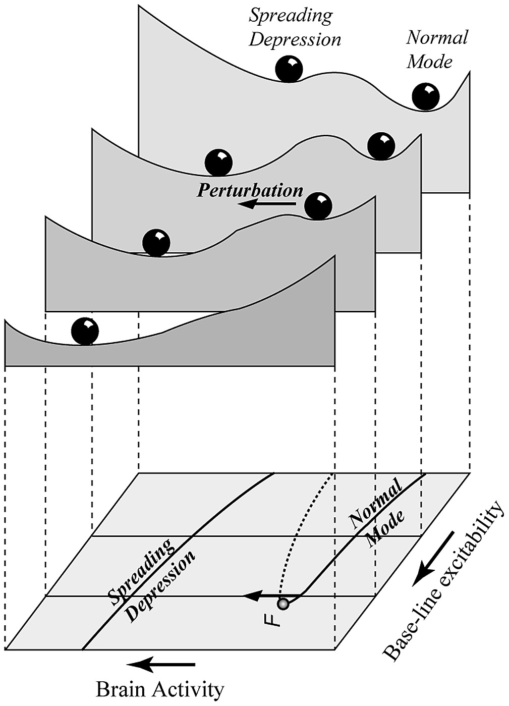

```{r setup, include = FALSE}
knitr::opts_chunk$set(
  collapse = TRUE,
  comment = "#>"
)
```

## Introduction
With knowledge becoming progressively more interdisciplinary, the relevance of science communication is increasing fast. Mathematical concepts are among the hardest topics to communicate to non-expert audiences, policy makers, and even to professionals from the so-called _soft sciences_. Visual methods are known to be, when applicable, successful ways of teaching and communicating mathematical results to non-specialists.

### Stability landscape figures
[comment1]: <> (Proved to be succesful)
One particularly successful visualization method is that of the stability landscape, also known as the rolling marble or ball-in-a-cup diagrams (@Beisner2003), and deeply related to the physical concept of scalar potential (@Zhou) and the mathematical of Lyapunov function (@Strogatz1994). Stability landscapes have proven to be a successful tool to understand and explain certain non-trivial concepts about dynamical systems, such as those of multistability, basin of attraction and even bifurcation, in a remarkably intuitive way (@Beisner2003, @Scheffer2001).



[comment2]: <> (Why does it work?)
The main reason for the success of this picture comes from the fact that stability landscapes are built as an analogy with our most familiar dynamical system: movement. Particularly, the movement of a marble along a curved surface under the influence of its own weight and a strong frictional force. It is important to stress the fact that under this picture there's not such a thing as inertia. The accurate analogy is that of a marble rolling in a surface while submerged inside a very viscous fluid (@Strogatz1994, @Pawlowski2006). This explains why our intuition, based in what we know about movement in our everyday life, works so well here. 

In stability landscapes the position of the marble represents the state of the system at a given time. With this picture in mind, the shape of the surface summarizes the underlying dynamical equations, being the slope the driver of the movement. Under this picture, the peaks on the undulated surface represent unstable equilibrium states and the wells represent stable equilibrium states. Different basins of attraction are separated by _mountain ridges_ in the surface. Summarizing: the marble naturally rolls downhill to the lowest point of its basin of attraction.

In order to understand why and how this analogy works for systems different than a rolling marble, we should begin with the understanding of the rolling marble itself.

From a mathematical point of view, the relationship between the surface $V(x,y)$ and the dynamics is given by equation $\ref{eq:2D}$.

\begin{equation}
\label{eq:2D}
  \begin{cases}
    \frac{dx}{dt} = f(x,y) = - \frac{\partial V}{\partial x} \\
    \frac{dy}{dt} = g(x,y) = - \frac{\partial V}{\partial y}
  \end{cases}
\end{equation}

[comment3]: <> (Limitations)
Like with any other analogy, it is important to be aware of its limitations. The most important one is the fact that, for general flows $f(x,y)$ and $g(x,y)$, it doesn't exist such a surface $V(x,y)$ satisfying equation $\ref{eq:2D}$. To get an intutive feeling of why this is true, picture a flow with a stable cyclic attractor. We need a surface where our marble can rotate in a closed loop while always going downhill. The kind of surface that only exists on M.C. Escher's paintings.

From an operational point of view, the surface $V(x,y)$ exists (and thus can be computed) if and only if the crossed derivatives of the elements of the flow are point-to-point identical (equation $\ref{eq:2Dcond}$). Flows satisfying this equation are known as irrotational or gradient flows.

\begin{equation}
\label{eq:2Dcond}
\frac{\partial f}{\partial y}(x,y) = \frac{\partial g}{\partial x}(x,y)
\end{equation}

### Generalization

Dynamics in equation $\ref{eq:2D}$ and the condition for the crossed derivatives $\ref{eq:2Dcond}$ can be straightforwardly generalized (see equations $\ref{eq:anyD}$ and $\ref{eq:anyDcond}$) to systems with an arbitrary number of state variables $\vec x = (x_1, ..., x_n)$.

\begin{equation}
\label{eq:anyD}
  \frac{d x_i}{dt} = f_i(\vec x) = -\frac{\partial V}{\partial x_i} : i = 1..n
\end{equation}

\begin{equation}
\label{eq:anyDcond}
  \frac{\partial f_i}{\partial g_j} = \frac{\partial f_j}{\partial g_i} : i \neq j
\end{equation}

It is important to note that the number of equations $N$ contained in condition $\ref{eq:anyDcond}$ grows with the dimensionality of the system $D$, particularly following the series of triangular numbers $N = \frac{1}{2}(D-1)D$. Thus, the higher the dimensionality, the harder is to fulfill condition $\ref{eq:anyDcond}$. As a side effect, we see that in one dimensional systems the condition contains $0$ equations and is thus automatically fulfilled, meaning that one dimensional systems always have a well defined landscape.

Using vector notation and the nabla operator $\vec \nabla$ both the dynamical equation and the condition can be written compactly for any number of dimensions(see equation $\ref{eq:vec}$ and condition $\ref{eq:vecCond}$). 

\begin{equation}
\label{eq:vec}
  \frac{d\vec x}{dt} = \vec f(\vec x) = - \vec{\nabla{V}}
\end{equation}

\begin{equation}
\label{eq:vecCond}
  \vec \nabla \times \vec f(\vec x) = \vec 0
\end{equation}


The nabla operator is used to generalize the concept of derivative to functions with more than one argument. For more information see @Marsden2003 or any other introductory text about vector calculus. During the rest of this paper we'll focus only in the two dimensional case shown in equation $\ref{eq:2D}$. There are two reasons for this choice. The first is that two-dimensional flows are the simpler systems that can lack a stability landscape (or equivalently: one-dimensional systems always have one). The second reason is that, being interested in visualization, we want to focus on _"surfaces"_ like $y = V(x)$ (i.e.: curves) and $z = V(x,y)$ (i.e.: surfaces), and not in hypersurfaces with too many dimensions to plot like $u = V(x,y,z)$. We made this choice motivated by didactical considerations despite the algorithm we developed can handle general n-dimensional flows.

## Methods
The method we propose is based on the numerical decomposition of our field in two components, a conservative or gradient part and a non-conservative or curl part:

\begin{equation}
\label{eq:FieldDecomposition}
\vec f (\vec x) = \vec f_{gradient} (\vec x) + \vec f_{curl} (\vec x)
\end{equation}

$\vec f_{gradient} (\vec x)$ captures all the part of the system that can be associated to a scalar potential, while $\vec f_{curl} (\vec x)$ represents the deviation from this ideal, conservative case. We'll use $\vec f_{gradient} (\vec x)$ to compute a scalar potential, which we will call pseudopotential. The absolute error of this approach will be given by $\parallel \vec f_{curl} (\vec x) \parallel$.

\subsection{Skew-symmetric decomposition}
\label{subsec:SkewSymmDecomposition}
Any square matrix can be easily and uniquely decomposed as the sum of a skew and a symmetric matrix.

\begin{equation}
\label{eq:SkewSymDec}
M = \frac{1}{2} \left( M + M^t \right) + \frac{1}{2} \left( M - M^t \right) \equiv M_{Symm} + M_{Skew}
\end{equation}

Being a unique decomposition, if the original matrix is already symmetric the computed skew matrix will be zero. Conversely, if the original matrix is already skew the symmetric part will be zero.

\subsection{Linear approximation}
\label{subsec:LinearApproximation}
Any sufficiently smooth and continuous vector field $\vec f(\vec x)$ can be approximated around the point $\vec{x_0}$ using linearization:

\begin{equation}
\label{eq:TaylorExp}
\vec f(\vec x) = \vec f(\vec{x_0}) + J(\vec{x_0}) \cdot \Delta \vec x + \mathcal{O} \left( \| \vec x \| ^2 \right)
\end{equation}

where $J(\vec{x_0})$ is the jacobian matrix evaluated at the approximation point $\vec{x_0}$ and $\Delta \vec x$ is defined as the vector distance to the approximation point, that is, $\Delta \vec x = \vec x - \vec{x_0}$.

Using the skew symmetric decomposition described in equation \ref{eq:SkewSymDec}, we can rewrite \ref{eq:TaylorExp} as:

\begin{equation}
\label{eq:TaylorExpDecomposed}
\vec f(\vec x) = \vec f(\vec{x_0}) + J_{Symm}(\vec{x_0}) \cdot \Delta \vec x + J_{Skew}(\vec{x_0}) \cdot \Delta \vec x+ \mathcal{O} \left( \| \vec x \| ^2 \right)
\end{equation}

This trick is interesting because it represents a natural decomposition of the field $\vec f(\vec x)$ in a gradient and a non-gradient term. More specifically, the only non-gradient term is the last one\footnote{This is deeply related with the Helmholtz decomposition: it is proven that, for a huge range of easy to fulfil conditions, any field can be decomposed as $\vec f (\vec x) = - \vec \nabla V (\vec x) + \vec \nabla \times \vec A (\vec x )$, where $V$ and $\vec A$ are known as scalar and vector potentials. Both of them have a straightforward natural interpretation, and are widely used, for instance, in electromagnetism and fluid dynamics}.

\begin{equation}
\label{eq:TaylorExpDecomposedAndGradient}
\vec f(\vec x) = - \vec \nabla V(\vec{x}) + J_{Skew}(\vec{x_0}) \cdot \Delta \vec x + \mathcal{O} \left( \| \vec x \| ^2 \right)
\end{equation}

This means that systems like \ref{eq:TaylorExp} are only gradient when their jacobians are symmetric and, thus, the skew component is a matrix of zeros.

Additionally, $V(\vec x)$ can be computed analytically by direct integration:

\begin{equation}
\label{eq:Potential}
V(\vec{x}) = V(\vec{x_0}) - \vec f(\vec x_0) \cdot \Delta \vec x - \frac{1}{2} \Delta \vec x^t \cdot J_{Symm} (\vec{x_0}) \cdot \Delta \vec x + \mathcal{O} \left( \| \vec x \| ^3 \right)
\end{equation}

\subsection{Numerical algorithm}
\label{subsec:NumericalAlgorithm}
The previous ideas open the possibility of an easy to implement numerical method using the following steps:

\begin{enumerate}
\item Create a grid in the phase plane $\left\lbrace \vec x_i \right\rbrace$
\item Calculate the jacobian $J(\vec{x_i})$ in each grid point
\item Decompose each jacobian in its skew $J_{Skew}(\vec{x_i})$ and symmetric $J_{Symm}(\vec{x_i})$ components
\item Assign potential 0 to the first point in the grid
\item Use each $J_{Symm}$ to compute the (pseudo)potential point by point, using equation $\ref{eq:Potential}$
\item Use the values of $J_{Skew}(\vec{x_i})$ as a measure of the quality of the approximation point by point (the higher the values in the skew matrix relative to the symmetric ones, the worse)
\end{enumerate}

\subsubsection{One dimensional case}
\label{subsubsec:1Dcase}
In the one-dimensional case it's always possible to find an exact scalar potential.

\begin{equation}
\label{eq:Field1D}
f(x) = f(x_i) + J(x_i) \cdot (x - x_i) : x \in [x_i, x_{i+1})
\end{equation}

\begin{equation}
\label{eq:Potential1D}
V(x) = V(x_i) - f(x_i) \cdot (x - x_i) - \frac{1}{2} J(x_i) \cdot (x - x_i)^2 : x \in [x_i, x_{i+1})
\end{equation}

Equation \ref{eq:Potential1D} is a recursion relation, so it requires an initialization value:

\begin{equation}
\label{eq:Potential1DInit}
V(x_0) = V_0
\end{equation}

This allows to calculate the potential in any point of the grid using:

\begin{equation}
\label{eq:Potential1DGrid}
V(x_i) = V(x_0) - \sum_{n = 0}^{i-1} \left( f(x_n) \cdot (x_{n+1} - x_n) + \frac{1}{2} J(x_n) \cdot (x_{n+1} - x_n)^2 \right)
\end{equation}

If the grid has been constructed with a constant step $\Delta x$, equation \ref{eq:Potential1DGrid} can be simplified as:

\begin{equation}
\label{eq:Potential1DGridSimp}
V(x_i) = V(x_0) - \Delta x \sum_{n = 0}^{i-1} \left( f(x_n) + \frac{1}{2} J(x_n) \cdot \Delta x \right)
\end{equation}

Notice that equations \ref{eq:Potential1DGrid} and \ref{eq:Potential1DGridSimp} are just algebraic relationships allowing to compute the potential at any node of the grid. Furthermore, equation \ref{eq:Potential1D} can be used to interpolate between the nodes.

It can be useful to define the auxiliary function:
\begin{equation}
\label{eq:Increment1D}
\Delta V(x_i, x_{i+1}) = -\int_{x_i}^{x_{i+1}} f(s) \cdot ds = - f(x_i) \cdot (x_{i+1} - x_i) - \frac{1}{2} J(x_i) \cdot (x_{i+1} - x_i)^2
\end{equation}

so the recursion relation reads:
\begin{equation}
\label{eq:Potential1DGridWithIncrement}
V(x_i) = V(x_0) + \sum_{n = 0}^{i-1} \Delta V(x_n, x_{n+1})
\end{equation}

### Code package

## Results

### A synthetic example

### Competition model

## Discussion
- Power of visualization and intuition
- Limits of visualization and intuition
- Peters projection and geometrical limits
- Why did we abandon the phase plane?
